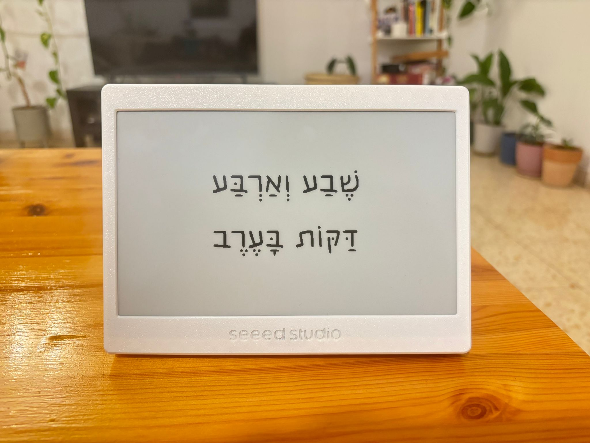

# 🕰️ Hebrew Inky Clock (HebrewClock)

A minimalist, high-contrast desk clock based on **E-Ink** technology and the **XIAO ESP32-C3** microcontroller. This project translates digital time into natural Hebrew phrases (e.g., "Six and thirty minutes in the evening").

---
<p align="center">
   
</p>

## ✨ Key Features
* **Smart NTP Sync:** Automatically fetches precision time from Google/NTP servers.
* **Hebrew Time Logic:** Full support for complex Hebrew time structures.
* **Auto-Timezone Handling:** Built-in support for Israel Standard Time (IST) and Daylight Time (IDT).
* **Anti-Ghosting Graphics:** Utilizes GxEPD2's temperature-compensated fast partial updates for trace-free minute ticks without annoying screen flashes! 
* **Dynamic Layout Engine:** Real-time calculation and centering of Hebrew text.

## 🙏 Credits & Inspiration
The original idea for this Hebrew word-clock was inspired by [**Matty Mariansky**](https://www.linkedin.com/in/supersize/). This project was developed as an evolution and implementation of that concept using the XIAO ESP32-C3 and E-Ink hardware stack.


## 🚀 Quick Start: Step-by-Step Setup

Follow these steps to get your clock running:

### 1. Set Up Arduino IDE
1. Download and install [Arduino IDE](https://www.arduino.cc/en/software).
2. **Add ESP32 Support:** Go to `File` > `Preferences`. In "Additional Boards Manager URLs", paste:
   `https://raw.githubusercontent.com/espressif/arduino-esp32/gh-pages/package_esp32_index.json`
3. Go to `Tools` > `Board` > `Boards Manager`, search for **ESP32**, and install the package.
4. **Install Libraries:** Go to `Sketch` > `Include Library` > `Manage Libraries` and install:
   * **GxEPD2** (by Jean-Marc Zingg)
   * **Adafruit GFX Library**

### 2. Connect the Board
1. Use a high-quality USB-C cable to connect your **XIAO ESP32-C3** to your computer.
2. In Arduino IDE, go to `Tools` > `Port` and select the port corresponding to your board.
3. Under `Tools` > `Board`, select **Seeed Studio XIAO ESP32-C3**.

### 3. Code
1. Clone or download this repository to your local machine.
2. Open the `HebrewClock.ino` file in your Arduino IDE.

### 4. Set Up WiFi (Private Settings)
1. Locate the file `arduino_private_example.h` in the project folder.
2. **Rename** it to `arduino_private.h`.
3. Open the file and enter your WiFi details:
   ```cpp
   #define SECRET_SSID "Your_WiFi_Name"
   #define SECRET_PASS "Your_WiFi_Password"
   ```
   
## 📜 License
This project is licensed under the **Creative Commons Attribution-NonCommercial 4.0 International (CC BY-NC 4.0)**. 

Essentially, this means:
* **You can** share and adapt the code for personal use.
* **You must** give appropriate credit to the original author.
* **You CANNOT** use this project or its derivatives for commercial purposes without explicit permission.